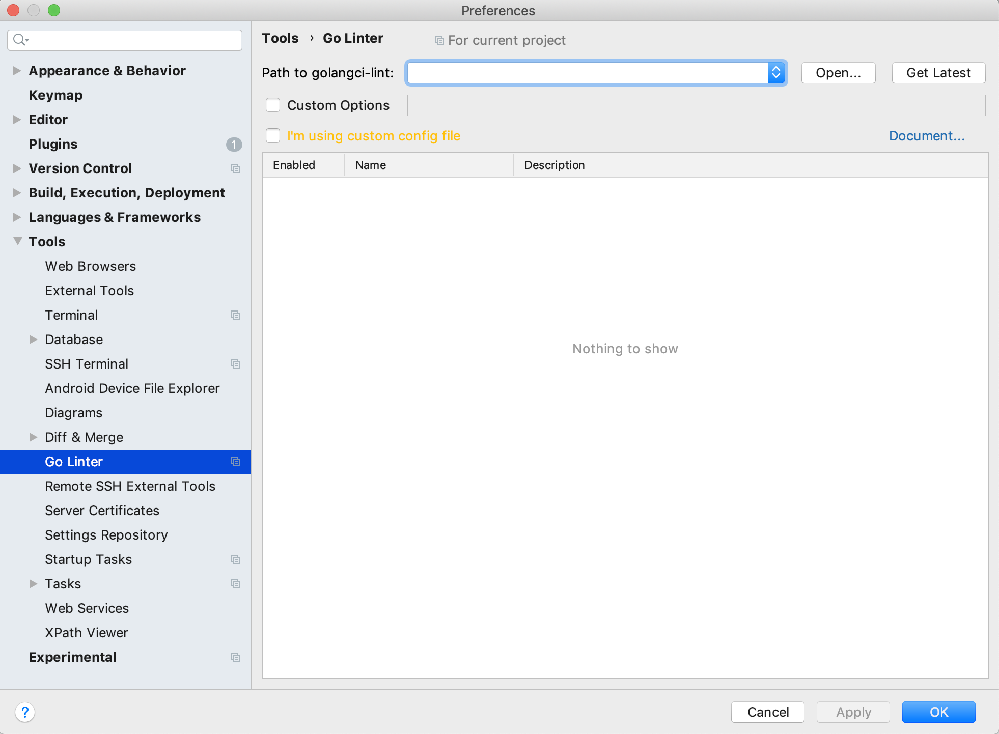
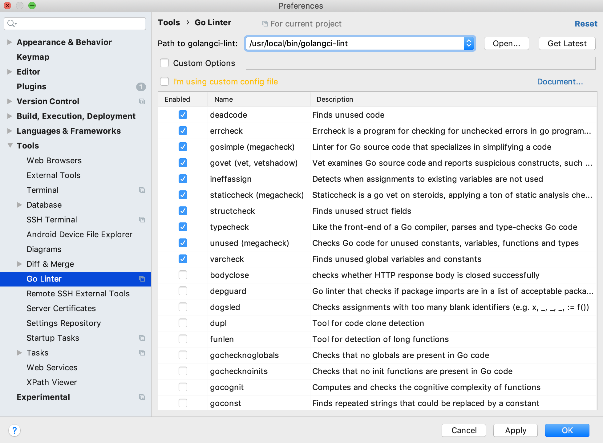

# Intellij/Goland Linter Inspection Plugin

Write code, write better code  
All credit goes to [GolangCI-Lint authors](https://github.com/golangci/golangci-lint/graphs/contributors).

================================  
## Heads up!
In case of warning: `Please make sure no syntax or config error`  
Please run `go mod tidy` to refresh deps

## How to use
After the plugin installed, you will see a popup on IDEA startup, otherwise please go to settings manually:

A **golangci-lint** executable is required. Choose one from combobox if you already have it in your PATH, or `Open...` select one from disk, or `Get Latest` download one from Github release.  

If you have your own `.golangci.json`|`.golangci.toml`|`.golangci.yaml`|`.golangci.yml` config file, the plugin will detect and use it.  
Otherwise, select linters you need:

Click `OK`, you are all set!

Please keep in mind that **golangci-lint** is a linter tool, **it only works if your project could build (no syntax error)**, or it will report no issue.

### Setting Guide
* I have a Go project as root project  
The default setting works perfectly
* I'm using Intellij Ultimate, I have a Go project nested in sub-dir  
Select `Project Root` to the Go project path
* I have multiple Go sub-projects in the root project  
Uncheck `Project Root`. **Be aware that only the config file directly under the root project will be used.**
* I want to use a config file not under root project  
Select `Using config:` to the config file

### For Windows users
Please disable goimports / gofmt / gci linters. Use [File-Watcher](https://tech.flyclops.com/posts/2016-06-14-goimports-intellij.html) in IDEA.  
*If you insist using those 3 linters, download <a href="http://ftp.gnu.org/gnu/diffutils/">GNU diff</a> & <a href="https://ftp.gnu.org/pub/gnu/libiconv/">GNU LibIconv</a> and put them in system PATH (eg: C:\WINDOWS). Normally it's missing from the system.*

## Report a bug
* Please note down your platform (Win/Linux/Mac), IDEA/Goland version, Go version
* If the plugin reports an error, please copy-paste the error content

## Next
* Code quality improvement
