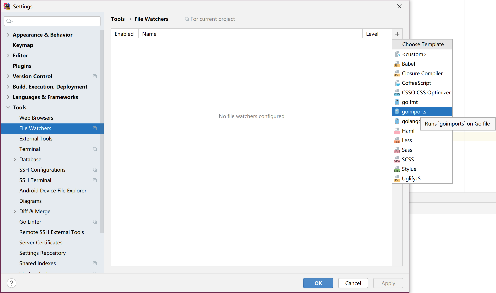
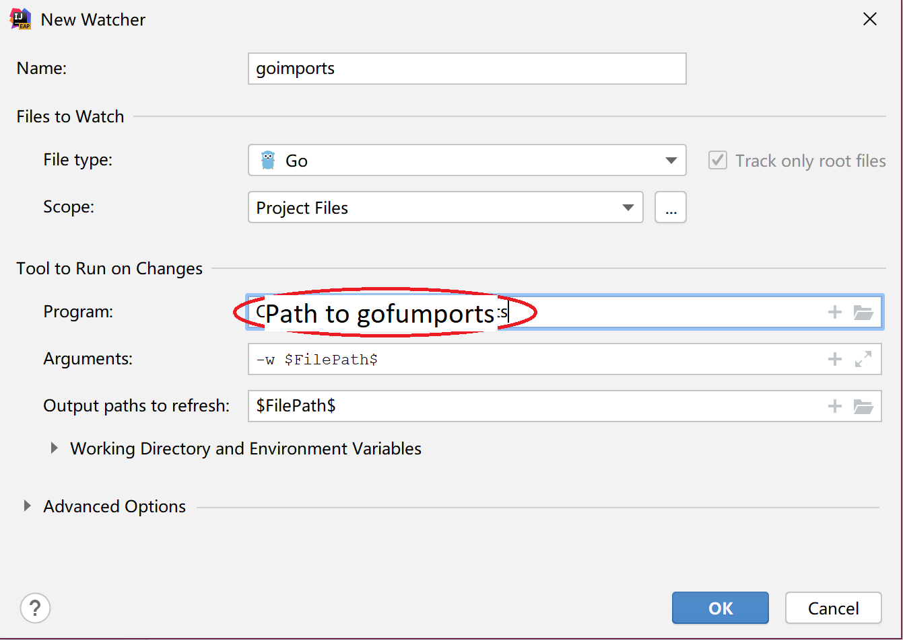

# gofumpt

**gofumpt** is a drop-in replacement for **gofmt**, which enforces a stricter format, more infos checkout [mvdan/gofumpt](https://github.com/mvdan/gofumpt)

It is recommended to use **gofumports** to replace **goimports**

## How to install
### Install gofumports
* Linux / MacOS  
```
GO111MODULE=on go get mvdan.cc/gofumpt/gofumports
```
* Windows  
```
set GO111MODULE=on
go get mvdan.cc/gofumpt/gofumports
```

### Install `File Watchers` plugin in Intellij / GoLand
### Add new watcher


